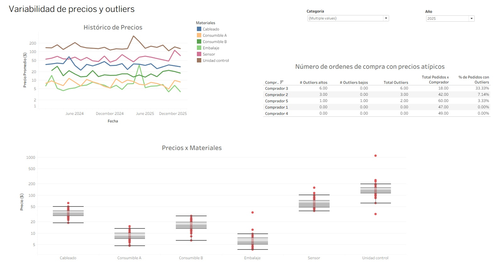

# Procurement Analytics Dashboard (Tableau)

## Project Context
This project presents a procurement analytics dashboard developed in Tableau, created in collaboration with Gladys Mendoza, as the final project for the course “Creation, Interpretation and Communication of Dashboards with Tableau”, delivered by CRN Fuencarral (Madrid).

Working within a limited timeframe, we focused on extracting meaningful insights and interpreting key business indicators rather than prioritizing visual complexity, aiming to build a clear business-oriented analytical story.

## Overview
This project analyzes procurement data focusing on:

- Supplier performance
- Pricing variability and outliers
- Purchasing distribution
- Delivery performance (ODT)

## Tools used
- Tableau
- Excel
- Data storytelling

## Key Insights

- **Pricing & Outliers:** Buyer 3 concentrates the highest number of high-price outliers, suggesting emergency purchasing behaviour. Low-price outliers could indicate potential quality risks.

- **Global Overview:** Between 2024 and 2025, purchase orders increased while total spending decreased by ~13%, with 3 categories representing ~74% of total spend.

- **Suppliers:** Spending distribution is balanced; around 80% of spending is spread across nearly two-thirds of suppliers, reducing dependency risk.

- **Logistics Performance:** Average delays are low, but maximum delivery deviations highlight opportunities for supplier performance monitoring.

## Tableau Public
[View Dashboard](https://public.tableau.com/app/profile/amaya.casanova.diaz/viz/Procurement_Public/FullAnalysisStory)

## 🖼 Dashboard Preview

